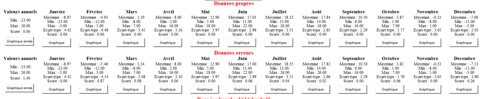
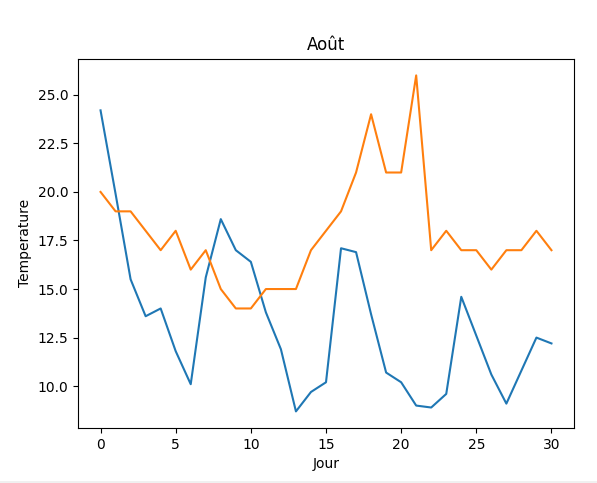
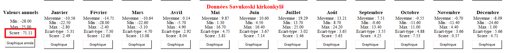
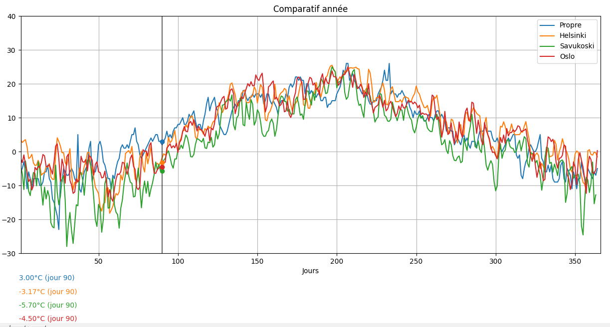
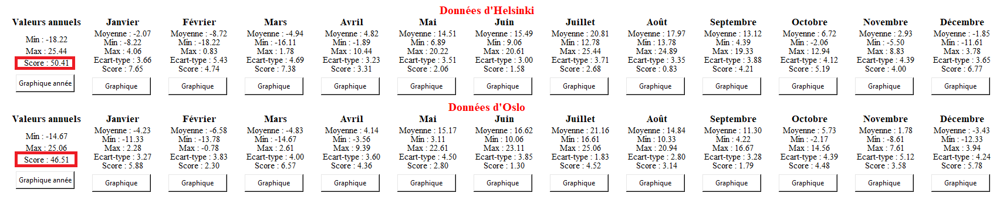

# tp_qualite_donnees

Repository du TP Qualité des données de Thomas SOHIER & Yann CLOAREC.

## Sans virtualenv

```py
pip install -r requirements.txt
```

## Virtualenv

```py
virtualenv {name}
source {name}/bin/activate
pip install -r requirements.txt
```

# Réponses questions 
## Méthodes correction erreurs du jeu de données :

Nous avons remplacé les valeurs non numériques ("0xFFFF" par exemple) par la moyenne de la veille + du lendemain. Afin d'avoir un jeu de données cohérent. 
Nous avons ensuite modifié les valeurs incohérentes, c'est à dire les valeurs ayant plus de 12°C d'écart entre la veille et le lendemain. Dans le cas du premier jour de l'année et du dernier nous afinons au seul jour dont nous possédons la donnée si l'écart entre ces deux là est de plus de 12°C.

## Les données corrigées sont elles proches des valeurs sans erreur ?

Les données corrigées sont extremement proches des valeurs sans erreur comme les graphiques le constatent. (Vous avez la possibilité, sur windows, de comparer le même mois avec les deux jeux de données en cliquant sur le graphique du premier jeu et ensuite sur le graphique du même mois du second jeu de données)
Le score calculé est de 1.40 donc quasiment identique (cf [Calcul du score](###calcul-du-score))




## Reprendre les données typiques de la localisation proche fournies en complément, comparer les écarts. Qu'en concluez vous ?

Les données de la localisation proche fournie en complément sont bien plus froide que celles de la ville à trouver. Nous pouvons en conclure que la ville à trouver est plus au sur que celle-ci car nous somme dans un climat froid.

Exemple sur le mois d'aout (Orange : ville à trouver / Bleu : Savukoski):



Le score sur l'année (cf [Calcul du score](###calcul-du-score)) est de 71.11, il est très elevé donc la ville n'est pas la meme




## De quelle la capitale européenne avez vous eu les données .
### Comparatif

Afin de comparer les écarts, le bouton "Comparatif année" permet l'affichage de toutes les sources de données sur le meme graphique (avec couleurs différentes) sur 1 an.



### Calcul du score

Afin de donner un score à chaque mois/année nous procédons tel quel :
- Différence de la moyenne du dataset de ville inconnu et d'un second dataset passé en paramètre.
- Différence de l'ecart type du dataset de ville inconnu et d'un second dataset passé en paramètre.
- On additionne le tout et cela nous donne un score.

Plus le score se rapproche de zéro, plus les valeurs sont proches.

### Résultat
D'après les villes que nous avons eu l'occasion de tester, Oslo est celle qui s'en rapproche le plus car sont score est le plus faible.



## Pour aller plus loin

Afin de trouver exactement la ville que nous cherchons, il faudrait tester sur beaucoup plus de données avec d'autres capitales européennes et d'autres années. Celle possédant le score sur l'année se rapprochant le plus de 0 sera la bonne. 