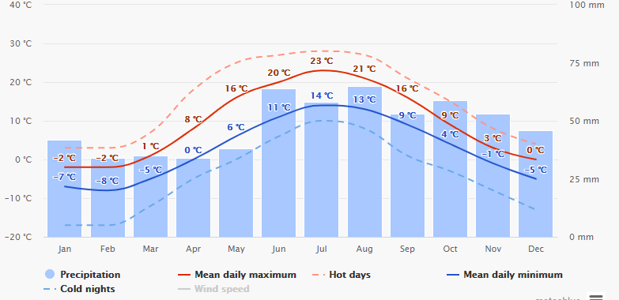

# tp_qualite_donnees

Repository du TP Qualité des données de Thomas SOHIER & Yann CLOAREC.

## Sans virtualenv

```py
pip install -r requirements.txt
```

## Virtualenv

```py
virtualenv {name}
source {name}/bin/activate
pip install -r requirements.txt
```

# Réponses questions 
## Méthodes correction erreurs du jeu de données :
Nous avons remplacé les valeurs non numériques ("0xFFFF" par exemple) par la moyenne de la veille + du lendemain. Afin d'avoir un jeu de données cohérent. 
Nous avons ensuite modifié les valeurs incohérentes, c'est à dire les valeurs ayant plus de 12°C d'écart entre la veille et le lendemain. Dans le cas du premier jour de l'année et du dernier nous afinons au seul jour dont nous possédons la donnée si l'écart entre ces deux là est de plus de 12°C.

## Les données corrigées sont elles proches des valeurs sans erreur ?
Les données corrigées sont extremement proches des valeurs sans erreur comme les graphiques le constatent. (Vous avez la possibilité, sur windows, de comparer le même mois avec les deux jeux de données en cliquant sur le graphique du premier jeu et ensuite sur le graphique du même mois du second jeu de données)
 
## Reprendre les données typiques de la localisaon proche fournies en complément , comparer les écarts. • Qu'en concluez vous ?
Les données de la localisation proche fournie en complément sont bien plus froide que celles de la ville a trouver. Nous pouvons en conclure que la ville a trouver est plus au sur que celle-ci car nous somme dans un climat froid.

## De quelle la capitale européenne avez vous eu les données .
Nous pensons que nous avons eu les données de la capitale Helsinki. Nous pouvons comparer nos informations avec cette image :
